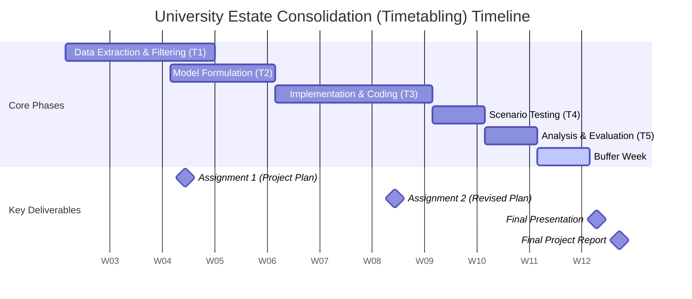

## Project Plan

### Project Overview
The primary objective of this project is to determine the feasibility of consolidating the university estate by closing all Holyrood campus general teaching rooms. The project will investigate whether the existing Central campus general teaching rooms can absorb this teaching load, or if additional support from Lauriston or New College is required. 
Success of the project will be determined by whether we produce a feasible timetable that reallocates all Holyrood events while meeting the following criteria:
- Space Utilisation: Maintaining appropriate room-fill percentages (typically 50%-100%) and ensuring classes are matched to rooms with correct capacities.
- Student Travel: Adhering to pre-set travel time allowances between campuses to ensure students can reach consecutive events
- Timeslot Utilisation: Evaluating how consolidation affects the distribution of classes across the standard teaching week i.e Monday–Friday from 9 am to 6 pm.

Model scope will include room occupancy, course curricula, and travel time constraints between different campus locations while excluding staff assignments and accessibility requirements.

Our modelling approach utilizes Mixed-Integer Programming which allows for structured allocation of resources to objects in space-time to satisfy specific objectives. In our case allocation of general teaching rooms in the Central campus to events while satisfying specific institutional objectives. The model must satisfy certain non-negotiable requirements that must be met for a timetable to be valid such as ensuring that all lectures for a course are scheduled into distinct time periods and each room hosts at most one lecture at any given time. The model also incorporates soft constraints that can be violated at a penalty cost. The objective is to minimize the total penalty derived from these violations, which in this scenario include room capacity limits, room stability and student travel time allowances. Given that practical timetabling problems are often large and computationally difficult, our modelling approach includes the use of heuristics to produce high-quality solutions within a reasonable amount of time, even if they cannot guarantee absolute optimality. This approach aims to provide a comprehensive analysis of whether the Central campus can absorb Holyrood's teaching load while maintaining acceptable space and timeslot utilisation.

### Responsibilities, deliverables and dependencies

|  Task ID |Task   | Deliverables  | Dependencies  |
|:---|:---|:---:|:---:|
|  1 |Data Extraction & Filtering: Isolate Holyrood, Central, Lauriston, and New College room and relevant event data (Member 1 & 3)|  Cleaned Data Set | None |   
|  2 |Model Formulation: Define hard constraints (no room clashes, curriculum conflicts) and soft constraints (travel time, room stability) (Member 2 & 3)| Optimisation Model | T1  |
|  3 |Implementation: Code the model using solver (Member 1)| Codebase  | T2  |
|  4 | Scenario Testing: Run the solver for the closure of holyrood scenario vs. the current baseline (Member 1,2,3) | Comparative Analysis  | T3  | 
|  5 | Analysis & Evaluation: Assess the impact on travel constraints and space utilisation (Member 1,2,3) | Final Results  | T4  |   

Tasks have been divided between group members for accountability purposes, however, all group members will be proactively contributing to the model building, refining and implementation throughout the duration of the project. The report will also be updated throughout the duration of the project, documenting the process.

### Gannt Chart

### Risk Register

|  Risk Description |  Probability | Impact  | Mitigation |
|:---|:---:|:---:|:---|
| Infeasible Solution: The Central campus may not have enough capacity for all Holyrood events | Medium  | High  | Relax soft constraints. Expand the scope to include Lauriston or New College  |
|Model Complexity: Solver takes too long to reach an optimal solution | High  | Medium   | Use heuristics to find good feasible solutions quickly, or simplify the model   |  
| Data Uncertainty: Predictions for student enrollment or course choices may be inaccurate  | Medium  | Medium  | Build a robust model that can accommodate late changes or small fluctuations in student numbers  |  
| Team Coordination: Eventualities such as illness or a busier period due to other coursework  | Medium  | High  |Use weekly workshop time for discussion and early check-ins with the course team. Set aside buffer week to cater for eventualities.  |

